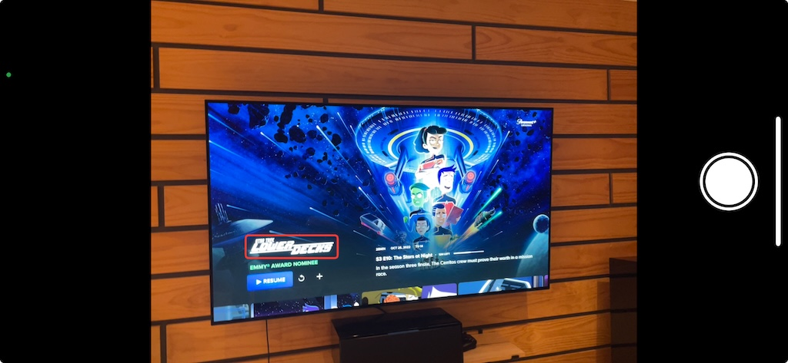

# Pomidor app
Get movie score when browsing streaming services on TV with one click

Current state:
* Identify and highlight movie title region using Apple Vision and custom ML model
* Crop image and peform text recognition
* Forward result to google search
* Support zoom

Next step:
* Use gemini/chat-gpt API to recognized cropped images and give back rotten tomate score
* With user permission, collect images and score. Upload to S3
* Use collected images to train model that can be deployed locally on the phone to improve OCR recognition
* Integration with open source moving score API
